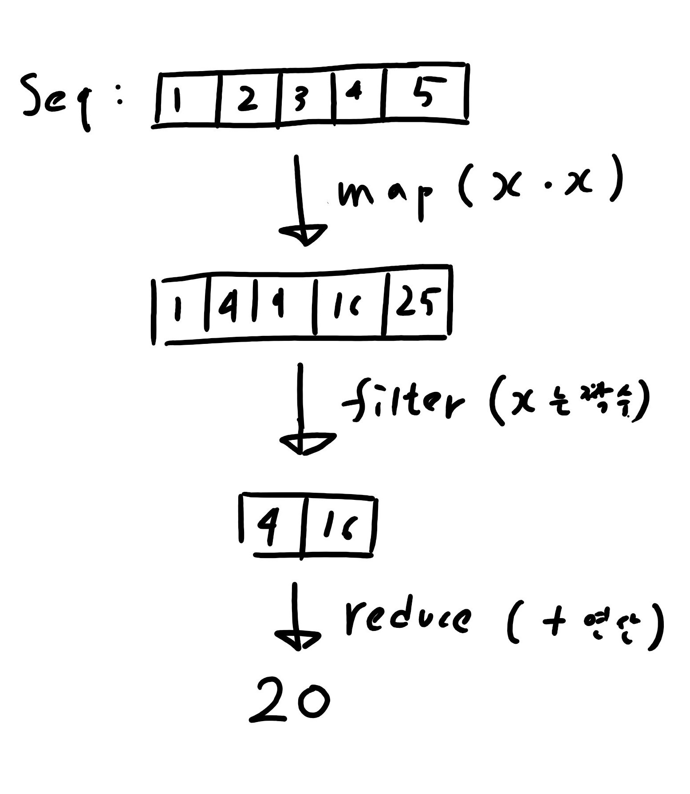

# lambda
이름없는 함수, 무명함수, 익명함수 등으로 변역되며 람다대수에 기초함.  
FP 에서는 함수를 1급 시민으로 취급하여 파라미터로 넘기거나 함수자체를 반환 할 수 있다.  
이때 파라미터로 넘길 함수를 따로 만들지 않고 그순간에만 사용하거나 간단한 식인경우 함수 본체만 넘기면 편한다.  

### 장점
코드가 간결해진다.


### 단점
디버깅할때 불편함.  
복잡한 로직을 람다로 만드는경우 오히려 복잡해 보일수 있다.
____
## Example
#### C++
```C++
기본 구조 : [](){}  // [캡쳐](파라미터){본문}
리턴값 명시 : []()->bool{}  
```
#### C#
```C#
() => {}  //(int x) => {return x*x;}
 => {}    // x -> {return x*x;}  (타입추론이 되는경우 타입 생략 가능)
 =>       // x => x*x
```

#### F#
```F#
(fun -> ) // (fun x -> x*x)
```
#### clojure
``` clojure
1. (fn [] ) 사용 // (fun [x] (* x x))
2. #() 사용 // #(* %1 %1)
```
____
# Map Reduce Filter
함수를 파라미터로 받아서 실행하거나 함수를 리턴해주는 함수를 고차함수라고 한다.  
Map Reduce Filter는 FP 에서 기초적이면서 가장 자주 사용하는 고차함수들이다.   

### Map
시퀀스의 각 요소를 다른 값으로 매핑 시키는 함수

### Filter
시퀀스에서 특정 조건의 요소만 필터링 하는 함수

### Reduce 
시퀀스의 값들을 특정 계산법을 통하여 하나의 값으로 리턴


